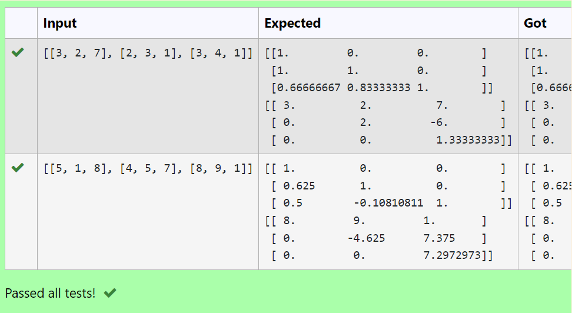

# LU Decomposition 

## Aim:
To write a program to find the LU Decomposition of a matrix.

## Equipments Required:
1. Hardware – PCs
2. Anaconda – Python 3.7 Installation / Moodle-Code Runner

## Algorithm:
## 1. To Find L and U matrices with LU Decomposition:
## Step 1:
Get the matrix from the user.

## Step 2:
Using "from scipy.linalg import lu" to import scipy (LU) module.

## Step 3:
Using "L,U=lu(a)" we can get the matrix of L and U.

## Step 4:
Print the result matrices (L and U Matrices).

## Step 5:
End of the Program.
## 2. To Find X matrix with LU Decomposition:
## Step 1:
Get the matrix from the user.

## Step 2:
Using "from scipy.linalg import lu_factor,lu_solve" to import scipy module for factorization and solving X.

## Step 3:
Using "lu,piv=lu_factor(a)"

## Step 4:
Print the output(x matrix)

## Step 5:
End of the Program.

## Program:
(i) To find the L and U matrix:

```python
/*
#Program to find L and U matrix using LU decomposition.
#Developed by: Tejaswini G
#RegisterNumber: 22004187
*/
import numpy as np
from scipy.linalg import lu
A = np.array(eval(input()))
P, L, U = lu(A)
print(L)
print(U)
```
(ii) To find the LU Decomposition of a matrix:
```python
/*
#Program to find the LU Decomposition of a matrix.
#Developed by: Tejaswini G
#RegisterNumber: 22004187
*/
import numpy as np
from scipy.linalg import lu_factor, lu_solve
A = np.array(eval(input()))
B = np.array(eval(input()))
lu, pivot = lu_factor(A)
x = lu_solve((lu,pivot),B)
print(x)
```

## Output:



## Result:
Thus the program to find the LU Decomposition of a matrix is written and verified using python programming.

